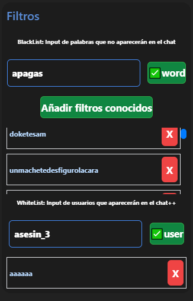

# Filtros actualizados
Hay filtros de palabras que puede agregar y tambien puede empezar con filtros por defecto.
- Por ahora solo esta la whitelist de usuarios
. 

## Minecraft interactive live
puede revisar `docs/MinecraftLive/MinecraftliveExample`[Minecraft ejemplos](/docs/MinecraftLive/MinecraftliveExample). 


## Filtros antiguos [no se usan]
- Filtro de comentarios 
- Desventaja de parseo y sintaxis
- obsoleto

### Filtro de comentarios 
Filtro de palabras que cada persona va añadiendo 
```
/frah ka/ /sah doh/ /e e / bajihnaz vajihnazh bajihnnash vajihnazh  phutha ghran /a a/ bajihnahs bajihnas vajihnas vajihnahs 7 jinash bajinahs 11 /+ tur/ baslapyn kerri nacidasta  arda gato ardha arhda ahrda ahrdha /mari i/ /i khon/ lazoketemeti grihtoh chau ngameh /Remah/ /ph erra/ caiapeh /Chih vah/ /peh rah/ / ghai/ /mhiardha / yaperochu /chuh pahme/ /im beh chil/ /lahpi ingah/ /a lash/ /Gus tah/ /pala brash/ /muh jeh/ /cah llah/ /izi sale/ destruk goreh pamelapynhgah delpichu /k cho/ /as coh/ llaperochuh pamelapinhgah /frah kah/ melavosh /eyakular / tttthummamma. vansokonun beshilketiensh /mih erdah/ ghram thekomeshtu phuto bherga chivholitos endopreh ejakah nenegrho pordio0 ñateh graphuta portuhkabeh poniatazo  tumamalaneh belkuh lodedah satejar   kabrodelarekonchadetuh ninias /mi ardha/ /frah ka/ /ka zado/ /vi holes/ /pn pn/ /PN PN/ tututitudice tututitu 12ghostrider12 eztesujeto  miliah datufa  chupa phinga haciah  tiradoenelpuen   tolasvo  pidocalen péné joshua.ticona welcome wó jaja 30hp phyngal 0hp ijodephutha tucuh  darunapa belkun  ª  teboyasacarlamih  nodeni narentukara pides graphuta tumamalaneh mentirachupamibhrgha   ilagranpehra rretiyeroijoepuhta astakeh directo comparti kameh neenunaba gobioh @ admin comerh welcome azekkk kometeh miqaqa  mabaslapin íbamaos sigue piu éramoschivolitos enguyete soychih Yaaaaaaa grospeh tolaphin  enapretadi ginadebe  gokareka   medarisaestepela drehesunazohrra unahpros  🐈‍⬛  kuloh kasinoh muchosh babhosoh nalditha  wª bahsura anopahsaron  tedesku   unanimalh  doketesam  unmachetedesfigurolacara Votame botatu   ardah  vhiolar yoagolokeh tihtuh demih petatemah  tonash klezyanas onunasko /Kun chatu/
```
Cada espacio es un filtro por separado
- Ejemplo:
```
hola esto noooo seeee leera
```
para palabras que se separan mucho escriba entre palabras como: ```/p e t e/``` para filtrar seria:
- Ejemplo:
```
/g a t o/ filtro /p e n e/ 
```


