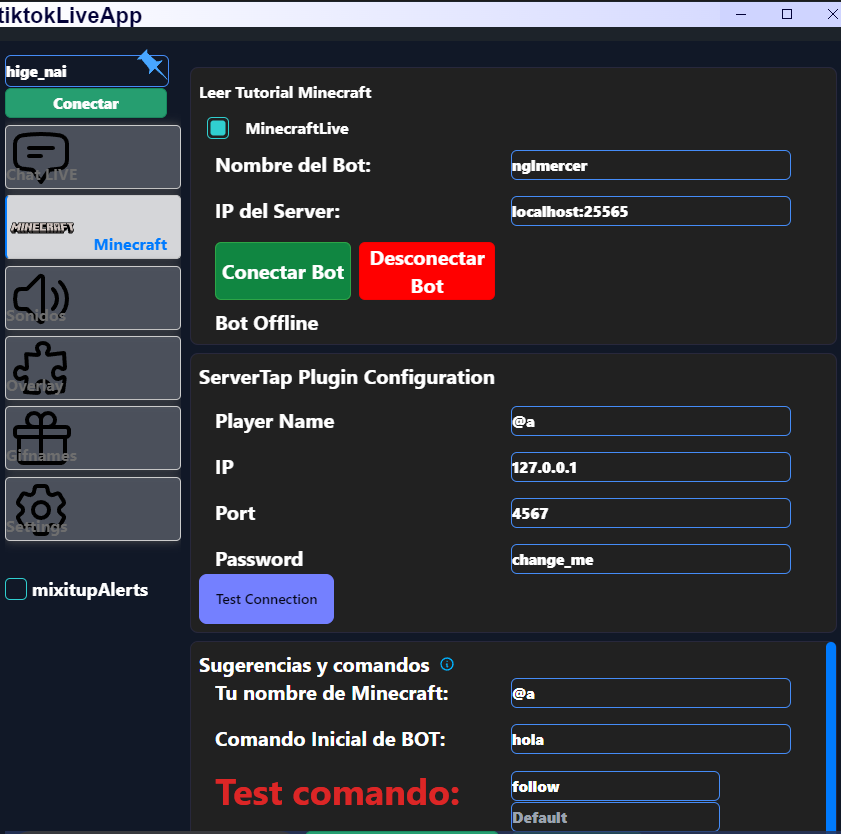

# Minecraft Inicio
### <font color="blue">OBLIGATORIO.</font>
Crea un bot para interactuar en un servidor
es obligatorio el
- **nombre del bot** 
- **Ip de servidor:puerto** 
- playername
### Opcional
- **Nombre del jugador minecraft**
- **Comando inicial**
- **Testeador de Comandos**
## Minecraft interactivo
Para configurarr el bot necesita saber que es cada uno de lo siguiente:
### <font color="blue">Nombre del bot.</font>
Nombre del bot que va a ingresar al servidor
### <font color="blue">Ip del server : puerto.</font>
- la ip y el puerto del servidor de minecraft por ejemplo:
> localhost
- por defecto el puerto es 25565 O coloque ip y puerto como: 
> melser.aternos.me:31310
### Su nombre del jugador minecraft
Coloque el nombre de usted que es el jugador de minecraft para usarlo en los comandos
### comando inicial
puede colocar un mensaje o comando como un login para que le bot ingrese a un server con login o un comando personalizado 
- /login contraseña
- /say hola soy un comando y tambien ingrese al server

### Testeador de Comandos
Puede escribir el evento y su objecto o solo el evento y ejecutara default.
- gift : Rose
- chat : default
- follow : default
- etc : default
## <font color="Green">Comandos de Live Interactivo.</font>
Aqui le muestro la sintaxis de minecraft :
### chat 
puede configurar los comandos por los comentarios que envian
La sintaxis del chat es la siguiente
```
/say este es un comando del chat
/say uniqueId Comment
  ```
### gift 
puede configurar los comandos por los regalos que envian
La sintaxis de gift es la siguiente
```
ejemplo default
  default:
/say este es un comando de regalos que envia uniqueId
/say uniqueId dio giftName xrepeatCount
ejemplo de Rose
  Rose:
/say este es comando de giftName
/say uniqueId regalo giftName xrepeatCount
  TikTok:
/say nickname dono xrepeatCount giftName
/say puedes meter tantos regalos quiera
  ```

### follow 
puede configurar los comandos por los que te sigen
La sintaxis de follow es la siguiente
```
/tellraw @a {\"text\":\"uniqueId  te sige \", \"color\":\"gold\"}
/say este es un comando de follow
/say uniqueId  te sige 
  ```
### share
puede configurar los comandos por los que te comparten
La sintaxis de share es la siguiente
```
/tellraw @a {\"text\":\"uniqueId  compartio \", \"color\":\"gold\"}
/say el comando anterior muestra cuando comparten
  ```
### welcome
puede configurar los comandos por los que te ingresan al Live
La sintaxis de WELCOME es la siguiente
```
  welcome:
/say join uniqueId
/execute at playername run give @a minecraft:golden_apple 1
  ```
cada vez que alguien ingresa el compando anterior nos da una manzana dorada
### envelope
puede configurar los comandos si envian un cofre
La sintaxis de envelope es la siguiente
```
envelope:
/say el pibe uniqueId envio un cofre
/execute at playername run playsound minecraft:entity.player.levelup ambient @p
```
el comando anterior envia un sonido de xp
### subscribe
puede configurar los comandos si se subscriben
La sintaxis de subscribe es la siguiente
```
subscribe:
/tellraw @a {\"text\":\"uniqueId se  subscribe \", \"color\":\"gold\"}
  ```
## Valores que reemplaza 
- uniqueId : valor que utiliza el nombre del usuario de tiktok
- nickname : valor que utiliza el nombre del usuario de tiktok
- comment : valor que utiliza su comentario en Live
- ``{milestoneLikes}`` : valor que utiliza el likes del usuario 
- ``{likes}`` : valor que utiliza likes del usuario
- giftName : valor que utiliza el nombre del regalo del usuario
- repeatCount : valor que utiliza el numero de veces que envio un regalo o giftname
- playername : valor que utiliza el nombre del jugador de minecraft
