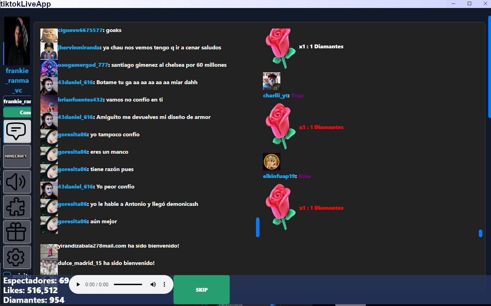
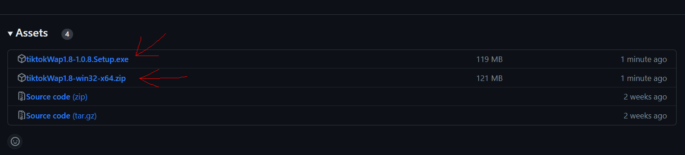
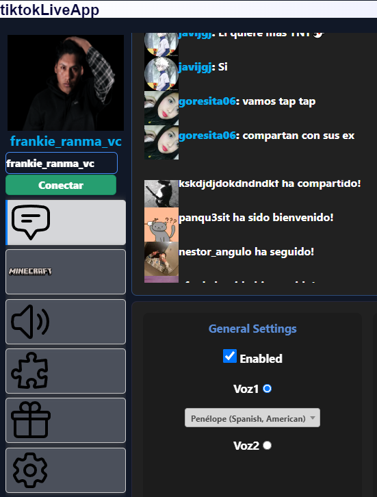
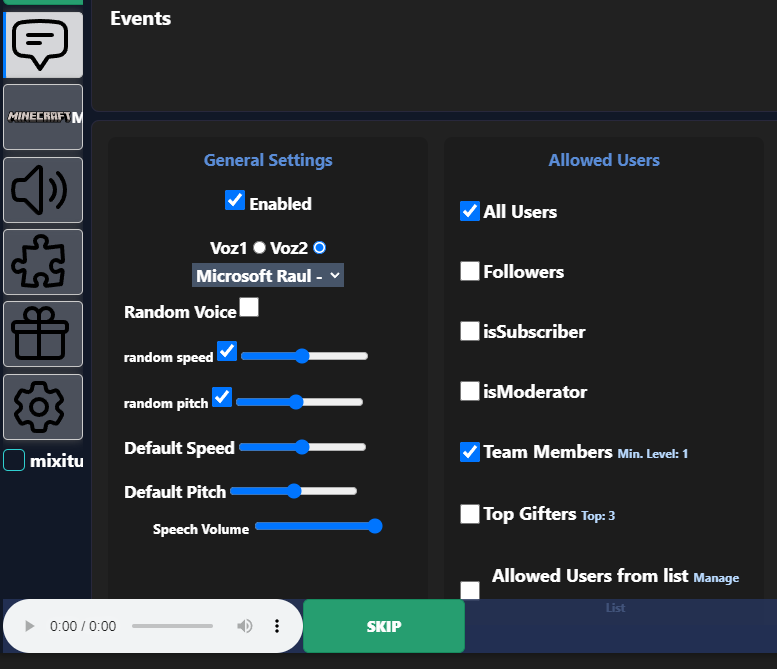
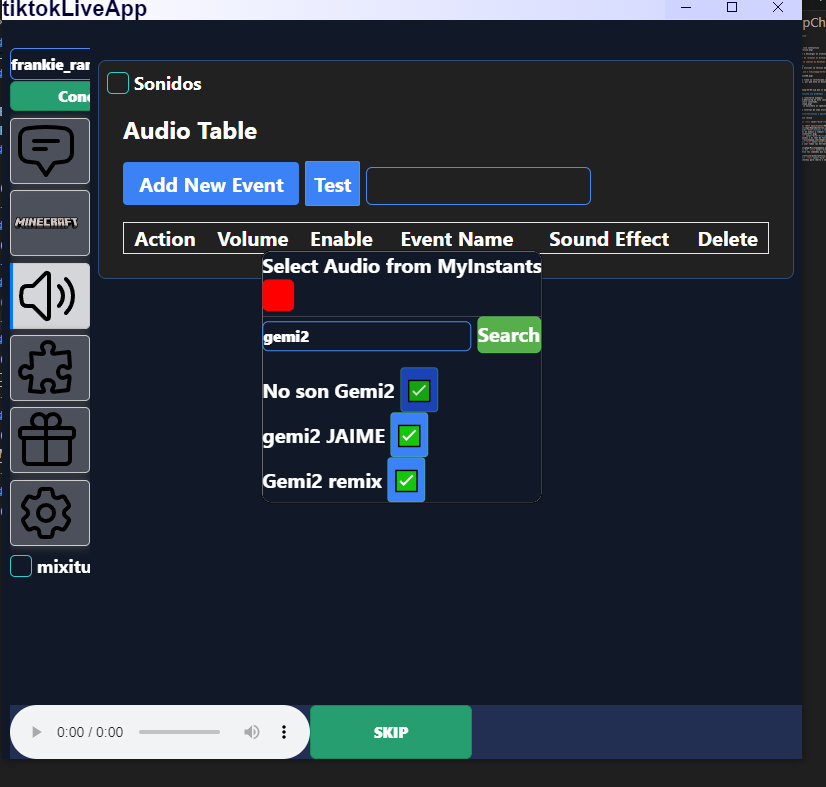
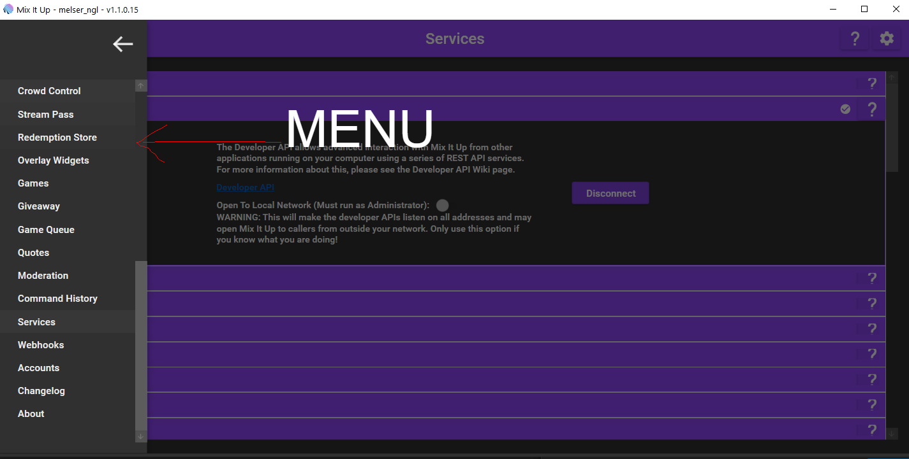

# Introduccion

¡WebApp TiktokLIVE!
herramienta para tiktok live interactivo
.
## Instalacion
Para instalar , deber ir y descargar el archivo.zip  ``` no el source code ```  o el ejecutable del siguiente link: 
### [Link para descargar de releases en Github](https://github.com/nglmercer/Tiktok-Live-TTS-APPv2/releases).
- ``Todas las versiones se subiran en Releases`` 

### Versiones Disponibles
Se recomienda instalar y utilizar la version mas reciente. Presione sobre el nombre del articulo a descargar:
- ```  TikLiveapp-32-64.exe o TikLiveapp-32-64.zip  ``` 
- imagen referencial:

:::danger[Download exe]
la aplicacion todavia no tiene un certificado por lo tanto
el exe esta en conflicto, por que esta en desarrollo.
:::

:::tip[recomiendo]
Utilze la el zip TikLiveapp-32-64.zip que no genera estos conflictos
:::
#### una vez instalado ejecute sin problemas , si desconfia puedes revisar el codigo 😊
## Como conectarse
Coloque su UniqueID para conectarse ejemplo:
- https://www.tiktok.com/@melserng en este caso seria @melserng
- https://www.tiktok.com/@frankie_ranma_vc en este caso seria @frankie_ranma_vc
y presione conectar y estara conectado.

- Despues de conectarse se escuchara el speechchat esta prendido.
## Como utilizar
Esta documentacion es un tutorial de como utilizar puede revisar cada apartado para saber de todo lo que contiene.
## <font color="Green">Caracteristicas y opciones.</font>

Este programa es opensouce revise
Funcionalidades:
### Speechchat voice chat <font color="Gold">Texto a voz.</font>

(el bot lee tus mensajes) [DOCS Speechchat](/DOCS/1FSpeechchat). 
- 
### SoundAlerts <font color="Gold">Sonidos y Alertas.</font>
(tiene soporte de alertas de audios y videos) [DOCS SoundAlerts](/DOCS/2FSounAlerts). 
-  
### twitch Crossover <font color="Gold">MixitupChat.</font>
(puedes conectar tus comandos y el chat de twitch)
-  
### MixitupApp API support <font color="Gold">MixitupApi.</font>
(conecta mixitupApp para usar todas las herramientas) [DOCS MixitupApp](/DOCS/MixitupApp/Introduccion).
-  
### Minecraft interactive Bot  <font color="Gold">Minecraft Live.</font>
(crea un bot para que envie los comandos que configures ) [DOCS MinecraftLive](/DOCS/MinecraftLive/Minecraft%20Live).
- 
### VRChat chatbox support  <font color="Gold">VRchat Chat ingame.</font>
(envia los mensajes al chatbox para leerlo o mostrarlo en el juego)