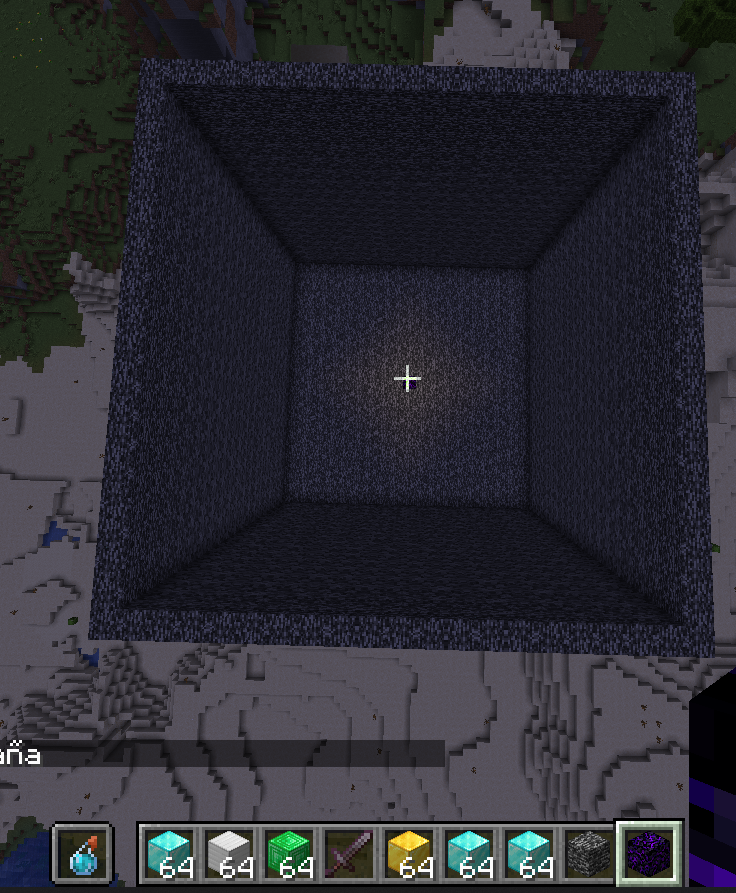

# Comandos y Recursos
:::tip[Comandos y Recursos en live]
Comandos que pueden ser utiles y necesarios para minecraft interactivo
:::
## Comandos fill o de colocacion de bloques
Para crear un cubo de countdown o rellenar el cubo
- utilize /fill o en su defecto /execute at playername run fill

```
/fill ~-10 ~ ~-10 ~10 ~20 ~10 minecraft:bedrock hollow
```
luego 
```
/fill ~-10 ~ ~-10 ~10 ~20 ~10 minecraft:air hollow
```
suba 20 bloques y reemplaze bedrock por air
:::tip[Colocar un indicador ]
Coloque un bloque al generar el cuadrado para saber el centro y crear otros comandos o contarlos
:::
