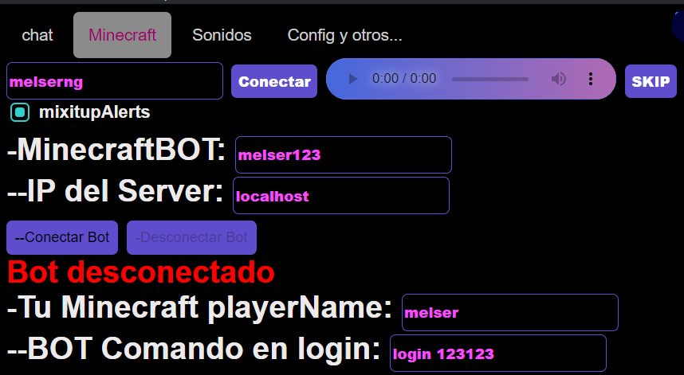

# configurarción Archivado
Crea un bot para interactuar en un servidor
es obligatorio el
- **nombre del bot** 
- **Ip de servidor**
- playername
### <font color="blue">OBLIGATORIO.</font>
## Minecraft interactivo
Para configurarr el bot necesita saber que es cada uno de lo siguiente:
### <font color="blue">Nombre del bot.</font>
Nombre del bot que va a ingresar al servidor
### <font color="blue">Ip del server : puerto.</font>
- la ip y el puerto del servidor de minecraft por ejemplo:
> localhost
- por defecto el puerto es 25565 O coloque ip y puerto como: 
> melser.aternos.me:31310
### Su nombre del jugador minecraft
Coloque el nombre de usted que es el jugador de minecraft para usarlo en los comandos
### comando inicial
puede colocar un mensaje o comando como un login para que le bot ingrese a un server con login o un comando personalizado 
- /login contraseña
- /say hola soy un comando y tambien ingrese al server

### Testeador de Comandos
Puede escribir el evento y su objecto
## <font color="Green">Comandos de Live Interactivo.</font>
Aqui le muestro la sintaxis de minecraft :
- Eventos como:
### chat 
puede configurar los comandos por los comentarios que envian
La sintaxis del chat es la siguiente
```
chat:
  - "/say este es un comando del chat"
  - "/say uniqueId Comment"
  ```
### gift 
puede configurar los comandos por los regalos que envian
La sintaxis de gift es la siguiente
```
gift:
  default:
    - "/say este es un comando de regalos que envia UniqueId"
    - "/say uniqueId dio giftName xrepeatCount"
  Rose:
    - "/say este es comando de giftName"
    - "/say uniqueId regalo giftName xrepeatCount"
  ```
### follow 
puede configurar los comandos por los que te sigen
La sintaxis de follow es la siguiente
```
follow:
  - "/tellraw @a {\"text\":\"uniqueId  te sige \", \"color\":\"gold\"}"
  - "/say este es un comando de follow"
  - "/say uniqueId  te sige "
  ```
### share
puede configurar los comandos por los que te comparten
La sintaxis de share es la siguiente
```
share:
  - "/tellraw @a {\"text\":\"uniqueId  compartio \", \"color\":\"gold\"}"
  - "/say el comando anterior muestra cuando comparten"
  ```
### welcome
puede configurar los comandos por los que te ingresan al Live
La sintaxis de WELCOME es la siguiente
```
  welcome:
  - "/say join uniqueId"
  - "/execute at playername run give @a minecraft:golden_apple 1"
  ```
cada vez que alguien ingresa el compando anterior nos da una manzana dorada
### envelope
puede configurar los comandos si envian un cofre
La sintaxis de envelope es la siguiente
```
envelope:
  - "/say el pibe uniqueId envio un cofre"
  - "/execute at playername run playsound minecraft:entity.player.levelup ambient @p"
```
el comando anterior envia un sonido de xp
### subscribe
puede configurar los comandos si se subscriben
La sintaxis de subscribe es la siguiente
```
subscribe:
  - "/tellraw @a {\"text\":\"uniqueId se  subscribe \", \"color\":\"gold\"}"
  ```
ESTOS SON TODOS LOS COMANDOS QUE PUEDES USAR
## Mobs e items para el Chat 
Eventos como chat gift follow share
Tambien en caso de comentarios
```
keywordToGive:
  escudo: "minecraft:shield"
  tnt": "minecraft:tnt 10"
  ```
Cada vez que comenten escudo nos daran escudo o cada vez que comenta tnt recibiremos tnt
  ```
keywordToMob:
  enderman": "minecraft:enderman"
  cerdo": "minecraft:pig"
  oveja": "minecraft:sheep"
  vaca": "minecraft:cow"
```
Cada vez que comenten tal mob invocara un mob a nuestro lado

#### Es para mobs o items para el chat