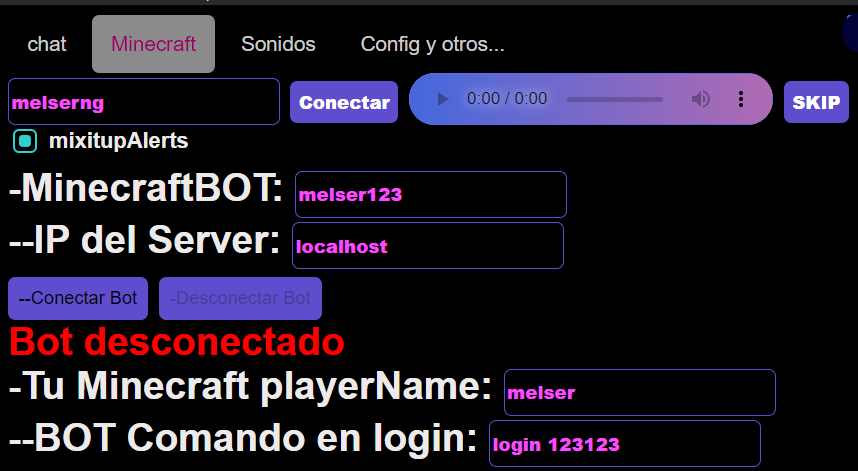

# set up for Minecraft
Create a bot to interact on a server
is required:
- **bot name** 
-  server id** **server id**
- playername
### <font color="blue">OBLIGATORY.</font>
## Minecraft interactive
To configure the bot you need to know what each of the following is:
### <font color="blue">Name bot.</font>
Name of the bot that is going to enter the server
### <font color="blue">Ip server : port.</font>
- the ip and port of the minecraft server for example:
> localhost
- default port is 25565 OR set ip and port as: 
> melser.aternos.me:31310
### Your minecraft player name
Enter the name of you who is the minecraft player to use in commands
### initial command
you can place a message or command as a login for the bot to enter a server with login or a custom command 
- /login password
- /say hello I am a commando and also login to the server

### Command Tester
You can write the event and its object or just the event and it will execute default.
- gift : Rose
- chat : default
- follow : default
- etc : default
## <font color="Green">Comands Live Interactivo.</font>
Aqui le muestro la sintaxis de minecraft :
### chat 
you can configure the commands by the comments they send
The chat syntax is as follows:
```
/say este es un comando del chat
/say uniqueId Comment
  ```
### gift 
you can configure the commands by the gifts you send
The syntax of gift is as follows
```
example default
  default:
/say este es un comando de regalos que envia uniqueId
/say uniqueId dio giftName xrepeatCount
example de Rose
  Rose:
/say este es comando de giftName
/say uniqueId regalo giftName xrepeatCount
  ```
### follow 
you can configure the commands by which you are followed
The syntax of follow is as follows:
```
/tellraw @a {\"text\":\"uniqueId  te sige \", \"color\":\"gold\"}
/say este es un comando de follow
/say uniqueId  te sige 
  ```
### share
puede configurar los comandos por los que te comparten
The syntax of share is as follows:
```
/tellraw @a {\"text\":\"uniqueId  compartio \", \"color\":\"gold\"}
/say el comando anterior muestra cuando comparten
  ```
### welcome
puede configurar los comandos por los que te ingresan al Live
The syntax of WELCOME is as follows:
```
  welcome:
/say join uniqueId
/execute at playername run give @a minecraft:golden_apple 1
  ```
cada vez que alguien ingresa el compando anterior nos da una manzana dorada
### envelope
puede configurar los comandos si envian un cofre
The syntax of envelope is as follows:
```
envelope:
/say el pibe uniqueId envio un cofre
/execute at playername run playsound minecraft:entity.player.levelup ambient @p
```
el comando anterior envia un sonido de xp
### subscribe
puede configurar los comandos si se subscriben
The syntax of subscribe is as follows:
```
subscribe:
/tellraw @a {\"text\":\"uniqueId se  subscribe \", \"color\":\"gold\"}
  ```
## Values it replaces 
- uniqueId : value using the tiktok user's name
- nickname : value using the tiktok user's nickname
- comment : value using your comment on Live
- ``{milestoneLikes}`` : value that uses the user's likes 
- ``{{likes}`` : value that uses the user's likes
- giftName : value using the user's gift name
- repeatCount : value using the number of times the user sent a gift or giftname
- playername : value using the minecraft player's name

```
  const replaceVariables = (command, data, likes) => {
    console.log(command);
    // Reemplazar variables en el comando (unchanged)
    let replacedCommand = command
      .replace(/uniqueId/g, data.uniqueId || '')
      .replace(/nickname/g, data.nickname || '')
      .replace(/comment/g, data.comment || '')
      .replace(/{milestoneLikes}/g, likes || '')
      .replace(/{likes}/g, likes || '')
      .replace(/message/g, data.comment || '')
      .replace(/giftName/g, data.giftName || '')
      .replace(/repeatCount/g, data.repeatCount || '')
      .replace(/playername/g, playerName || '');
  
    // Convertir el comando a minúsculas
    replacedCommand = replacedCommand.toLowerCase();
  
    // Remove all backslashes (proceed with caution!)
    replacedCommand = replacedCommand.replace(/\\/g, '');
  
    console.log(replacedCommand);
    return replacedCommand;
  };
  
```