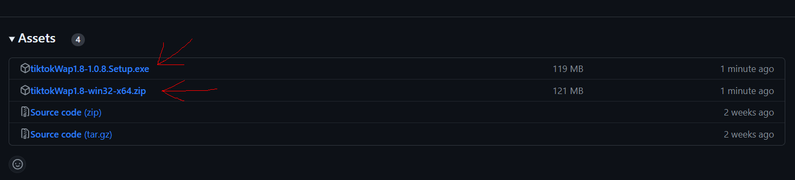
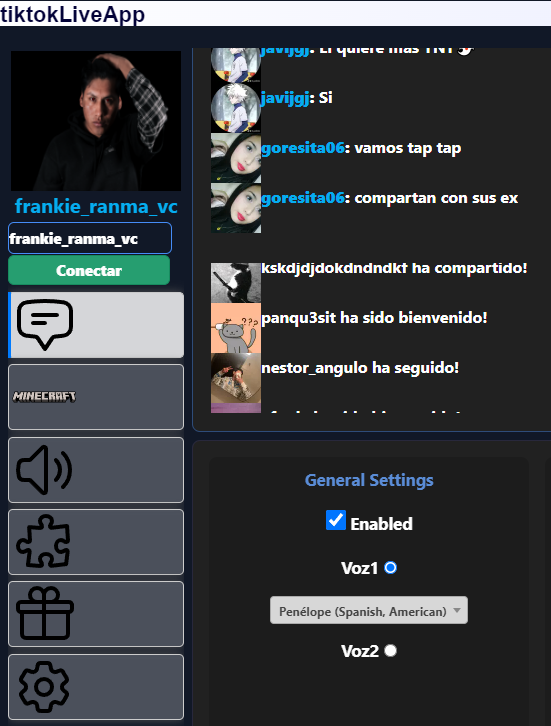
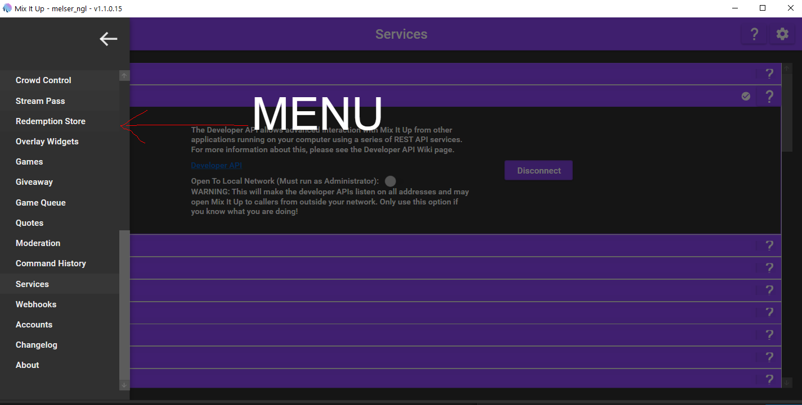
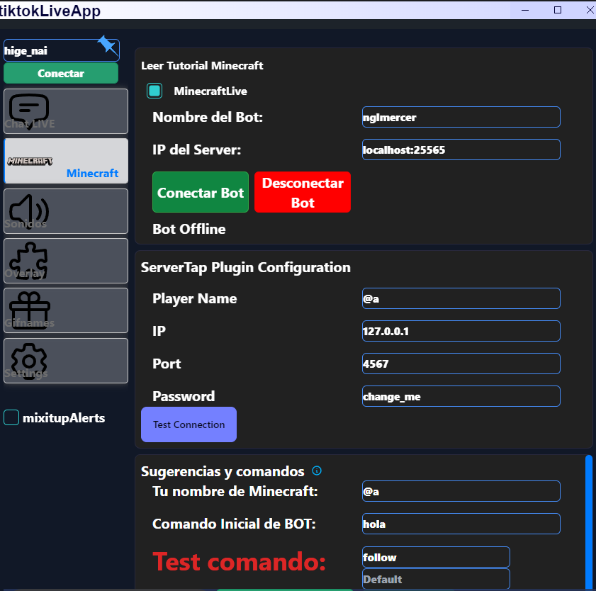

# Installation

WebApp TiktokLIVE!
tool for interactive tiktok live
## Installation
To install, you must go and download the ```.zip file, not the ``` source code or the executable from the following link:
### [Link to download releases on Github](https://github.com/nglmercer/Tiktok-Live-TTS-APPv2/releases).
- ``All versions will be uploaded in Releases``

### Available Versions
It is recommended to install and use the most recent version. Click on the name of the article to download:
- ```  TikLiveapp-32-64.exe o TikLiveapp-32-64.zip  ``` 
- referential image:

:::danger[Download exe]
The application does not yet have a certificate therefore
The exe is in conflict, because it is under development.
:::

:::tip[recommend]
Use the TikLiveapp-32-64.zip zip that does not generate these conflicts
:::
#### once installed run without problems, if you are suspicious you can review the code 😊
## How to connect
Enter your UniqueID to connect example:
- https://www.tiktok.com/@melserng in this case is @melserng
and press connect and you will be connected.

- After connecting you will hear the speechchat being on.

## How to use
This documentation is a tutorial on how to use it. You can review each section to find out everything it contains.
## <font color="Green">Features and options.</font>

This program is opensouce review
Features:
### Speechchat voice chat <font color="Gold">text to speech.</font>

(the bot reads your messages) [DOCS Speechchat](/DOCS/1FSpeechchat). 
- 
### Sounds and Alerts <font color="Gold">Sounds and Alerts.</font>
(has support for audio and video alerts) [DOCS SoundAlerts](/DOCS/2FSounAlerts). 
-  
### twitch Crossover <font color="Gold">MixitupChat.</font>
(you can connect your commands and twitch chat)
-  
### MixitupApp API support <font color="Gold">MixitupApi.</font>
(connect mixitupApp to use all tools) [DOCS MixitupApp](/DOCS/MixitupApp/Introduccion).
-  
### Minecraft interactive Bot  <font color="Gold">Minecraft Live.</font>
(create a bot to send the commands you configure) [DOCS MinecraftLive](/DOCS/MinecraftLive/Minecraft%20Live).
- 
### VRChat chatbox support  <font color="Gold">VRchat Chat ingame.</font>
(send messages to chatbox to read or show in game)